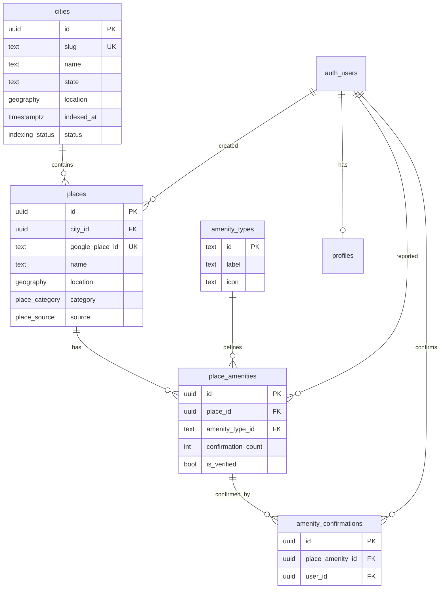

# Modelo de dados — Pcity MVP

Fonte da verdade para schema, relações e regras de acesso. Cidade piloto: **Franca, SP**.

## Visão geral

```
auth.users (Supabase Auth)
    │
    ├── profiles
    │
cities
    │
    └── places
            │
            └── place_amenities ── amenity_types (catálogo fixo)
                    │
                    └── amenity_confirmations
```

| Entidade | Papel |
|---|---|
| `cities` | Cidades indexadas (seed Google Places) |
| `places` | Bares, restaurantes e similares |
| `amenity_types` | Catálogo fixo de comodidades (MVP) |
| `place_amenities` | Comodidade reportada em um lugar + contador |
| `amenity_confirmations` | Confirmação por usuário (evita contagem duplicada) |
| `profiles` | Dados públicos mínimos do usuário |

## Diagrama ER



---

## Enums

### `indexing_status`

Status da indexação Google Places de uma cidade.

| Valor | Significado |
|---|---|
| `pending` | Nunca indexada |
| `in_progress` | Indexação em andamento |
| `completed` | Dados no banco |
| `failed` | Falhou (pode retentar) |

### `place_source`

| Valor | Significado |
|---|---|
| `google` | Importado via Google Places API |
| `user` | Cadastrado por usuário (fase futura) |

### `place_category`

| Valor | Label (UI) |
|---|---|
| `bar` | Bar |
| `restaurant` | Restaurante |
| `cafe` | Café / lanchonete |
| `other` | Outro |

---

## Tabelas

### `cities`

Cidades disponíveis no app. No MVP, Franca é pré-seedada.

| Coluna | Tipo | Notas |
|---|---|---|
| `id` | `uuid` | PK, `gen_random_uuid()` |
| `slug` | `text` | UK — ex: `franca-sp` |
| `name` | `text` | ex: `Franca` |
| `state` | `text` | ex: `SP` |
| `country` | `text` | default `BR` |
| `location` | `geography(Point, 4326)` | Centro da cidade |
| `indexed_at` | `timestamptz` | Quando a indexação terminou |
| `indexing_status` | `indexing_status` | default `pending` |
| `created_at` | `timestamptz` | |
| `updated_at` | `timestamptz` | |

**Índices:** `slug`, GIST em `location`.

---

### `places`

Estabelecimentos. Dados base vêm do Google; comodidades vêm da comunidade.

| Coluna | Tipo | Notas |
|---|---|---|
| `id` | `uuid` | PK |
| `city_id` | `uuid` | FK → `cities` |
| `google_place_id` | `text` | UK, nullable (lugares `user`) |
| `name` | `text` | |
| `address` | `text` | Endereço formatado |
| `location` | `geography(Point, 4326)` | Lat/lng do lugar |
| `phone` | `text` | nullable |
| `website` | `text` | nullable |
| `category` | `place_category` | default `other` |
| `source` | `place_source` | default `google` |
| `created_by` | `uuid` | FK → `auth.users`, nullable |
| `is_active` | `boolean` | default `true` — soft delete |
| `created_at` | `timestamptz` | |
| `updated_at` | `timestamptz` | |

**Índices:** `city_id`, UK `google_place_id`, GIST em `location`.

**Busca por proximidade (exemplo):**

```sql
SELECT p.*, ST_Distance(p.location, ST_MakePoint(:lng, :lat)::geography) AS distance_m
FROM places p
WHERE p.city_id = :city_id
  AND p.is_active = true
ORDER BY distance_m
LIMIT 50;
```

---

### `amenity_types`

Catálogo fixo no MVP — sem campo livre.

| `id` | `label` | `icon` |
|---|---|---|
| `kids_area` | Espaço kids | 👶 |
| `pet_friendly` | Pet friendly | 🐕 |
| `outdoor` | Área externa | ☀️ |
| `live_music` | Música ao vivo | 🎵 |
| `parking` | Estacionamento | 🅿️ |
| `wifi` | Wi-Fi | 📶 |
| `accessible` | Acessível | ♿ |

| Coluna | Tipo | Notas |
|---|---|---|
| `id` | `text` | PK |
| `label` | `text` | Exibido na UI |
| `icon` | `text` | Emoji ou nome de ícone |
| `sort_order` | `smallint` | Ordem na UI |
| `is_active` | `boolean` | default `true` |

---

### `place_amenities`

Uma linha por par `(place, amenity_type)`. Criada no primeiro report; confirmada por outros usuários.

| Coluna | Tipo | Notas |
|---|---|---|
| `id` | `uuid` | PK |
| `place_id` | `uuid` | FK → `places` |
| `amenity_type_id` | `text` | FK → `amenity_types` |
| `confirmation_count` | `int` | default `1` |
| `is_verified` | `boolean` | `true` quando `confirmation_count >= 3` |
| `first_reported_by` | `uuid` | FK → `auth.users` |
| `first_reported_at` | `timestamptz` | |
| `verified_at` | `timestamptz` | Quando atingiu threshold |
| `created_at` | `timestamptz` | |
| `updated_at` | `timestamptz` | |

**Constraints:** UK `(place_id, amenity_type_id)`.

**Regra de verificação:** `is_verified = true` e `verified_at = now()` quando `confirmation_count >= 3` (trigger).

---

### `amenity_confirmations`

Registro de quem confirmou — impede o mesmo usuário de contar duas vezes.

| Coluna | Tipo | Notas |
|---|---|---|
| `id` | `uuid` | PK |
| `place_amenity_id` | `uuid` | FK → `place_amenities` |
| `user_id` | `uuid` | FK → `auth.users` |
| `created_at` | `timestamptz` | |

**Constraints:** UK `(place_amenity_id, user_id)`.

---

### `profiles`

Extensão de `auth.users` para exibição mínima (ex.: "3 pessoas confirmaram").

| Coluna | Tipo | Notas |
|---|---|---|
| `id` | `uuid` | PK, FK → `auth.users` |
| `display_name` | `text` | nullable |
| `avatar_url` | `text` | nullable |
| `created_at` | `timestamptz` | |
| `updated_at` | `timestamptz` | |

Criado automaticamente via trigger no signup (`handle_new_user`).

---

## Fluxos de dados

### Indexação de cidade (seed Google)

```
1. Admin/job marca city.indexing_status = in_progress
2. API busca lugares no Google Places (bares, restaurantes)
3. INSERT em places (source = google, ON CONFLICT google_place_id DO NOTHING)
4. city.indexing_status = completed, indexed_at = now()
```

No lançamento em Franca, isso roda **antes** de abrir ao público.

### Reportar comodidade nova (login obrigatório)

```
1. Usuário autenticado escolhe amenity_type em um place
2. INSERT place_amenities (confirmation_count = 1, first_reported_by = user)
   — o reportador já conta como 1; sem linha em amenity_confirmations
```

Se já existir `(place_id, amenity_type_id)` → erro ou redireciona para confirmar.

### Confirmar comodidade existente

```
1. INSERT amenity_confirmations (place_amenity_id, user_id)
   — rejeitado se user_id = first_reported_by (trigger)
2. Trigger incrementa place_amenities.confirmation_count
3. Se count >= 3 → is_verified = true, verified_at = now()
```

Com threshold 3: 1 report + 2 confirmações de outros usuários = verificado.

---

## Row Level Security (RLS)

A API Go usa `pgx` com role de serviço no backend. RLS protege acesso direto via Supabase client no futuro.

| Tabela | SELECT | INSERT | UPDATE | DELETE |
|---|---|---|---|---|
| `cities` | público | service role | service role | service role |
| `places` | público | service role | service role | service role |
| `amenity_types` | público | — | — | — |
| `place_amenities` | público | autenticado (próprio `first_reported_by`) | — | — |
| `amenity_confirmations` | autenticado | autenticado (`user_id = auth.uid()`) | — | — |
| `profiles` | público | trigger signup | próprio perfil | — |

**Nota:** writes sensíveis (indexação, moderação) passam pela API Go com service role. Contribuições sociais podem ir pela API validando JWT ou direto no Supabase com RLS.

---

## Decisões explícitas (MVP)

| Decisão | Escolha |
|---|---|
| Threshold de verificação | 3 confirmações de usuários distintos |
| Comodidades | Catálogo fixo (`amenity_types`), sem texto livre |
| Lugares user-submitted | Schema pronto (`source = user`), UI na fase 2 |
| Soft delete | `places.is_active` |
| Geo | PostGIS `geography` (distância em metros) |
| Reviews / fotos | Fora do MVP — não modelado aqui |

---

## Seed inicial

A migration `000001_initial_schema.sql` inclui:

- Extensões: `postgis`, `pgcrypto`
- Enums, tabelas, índices, triggers
- RLS policies
- Catálogo `amenity_types`
- Cidade piloto `franca-sp`

---

## Próximo passo

Implementação: API Go → scaffold Expo → telas na ordem Lista → Detalhe → Auth → Sheet → Perfil.
