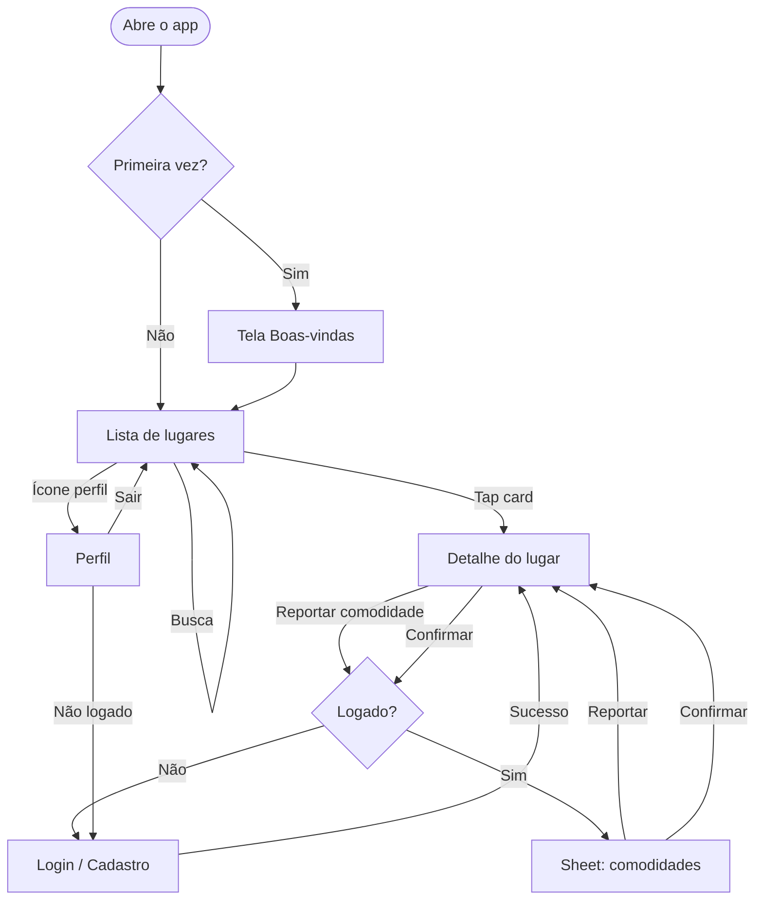
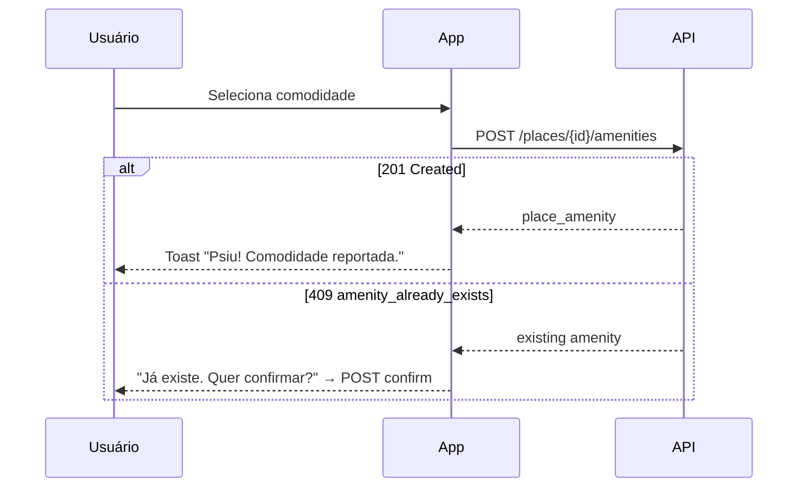
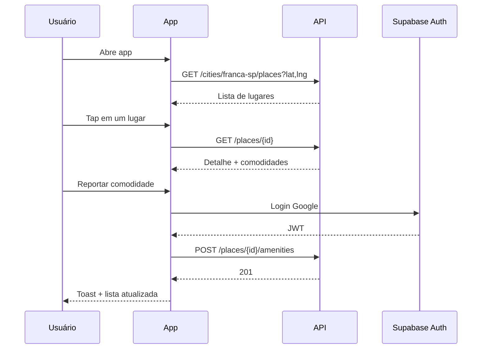

# Fluxos de UX — Pcity MVP

Wireframes, navegação e copy das telas do MVP. Cidade piloto fixa: **Franca, SP** (`franca-sp`).

**Relacionados:** [api.openapi.yaml](api.openapi.yaml) · [data-model.md](data-model.md)

---

## Princípios de UX

| Princípio | Aplicação |
|---|---|
| Lista primeiro | Sem mapa no MVP; cards escaneáveis com ícones de comodidade |
| Valor em 5s | Tagline + lista carregada; comodidades visíveis no card |
| Contribuir com fricção mínima | Ver lugares sem login; login só ao reportar/confirmar |
| Tom Pcity | Leve, brasileiro, *picíti* — útil sem ser corporativo |
| GPS opcional | App funciona sem GPS; com GPS ordena por distância |

---

## Mapa de navegação



### Rotas sugeridas (Expo Router)

| Rota | Tela |
|---|---|
| `app/index.tsx` | Lista de lugares (home) |
| `app/place/[id].tsx` | Detalhe |
| `app/auth/login.tsx` | Login / cadastro |
| `app/onboarding.tsx` | Boas-vindas (1ª abertura) |
| `app/profile.tsx` | Perfil |

---

## Telas do MVP

1. **Boas-vindas** — onboarding único
2. **Lista** — tela principal
3. **Detalhe** — lugar + comodidades + ações
4. **Sheet de comodidades** — reportar / confirmar
5. **Login** — email + Google
6. **Perfil** — mínimo (nome, sair)

---

## 1. Boas-vindas (onboarding)

Exibida **uma vez** (`AsyncStorage`: `onboarding_seen`).

```
┌─────────────────────────────┐
│                             │
│         [ Logo P ]          │
│                             │
│      Psiu… achou!             │
│                             │
│  Bares e restaurantes de    │
│  Franca com o que importa:    │
│  espaço kids, pet friendly    │
│  e muito mais.                │
│                             │
│  ┌─────────────────────┐    │
│  │   Começar           │    │
│  └─────────────────────┘    │
│                             │
└─────────────────────────────┘
```

| Elemento | Comportamento |
|---|---|
| Logo | Marca Pcity |
| Tagline | *"Psiu… achou!"* |
| CTA | Navega para Lista; pede permissão de localização **depois** (na lista) |

**API:** nenhuma.

---

## 2. Lista de lugares (home)

Tela principal. Cidade fixa **Franca, SP** no header (sem seletor no MVP).

```
┌─────────────────────────────┐
│  Pcity              [ 👤 ]  │
├─────────────────────────────┤
│  📍 Franca, SP              │
├─────────────────────────────┤
│  🔍 Buscar lugar...         │
├─────────────────────────────┤
│  ┌─────────────────────┐    │
│  │ Bar do Zé           │    │
│  │ Rua X, 123 · 1,2 km │    │
│  │ 👶 🐕 ☀️            │    │
│  └─────────────────────┘    │
│  ┌─────────────────────┐    │
│  │ Restaurante Sabor   │    │
│  │ Av. Y, 456 · 2,5 km │    │
│  │ 🅿️ 📶               │    │
│  └─────────────────────┘    │
│         ...                 │
└─────────────────────────────┘
```

### Estados

| Estado | UI | API |
|---|---|---|
| Carregando | Skeleton ou spinner + *"Buscando lugares..."* | `GET /cities/franca-sp/places?lat=&lng=` |
| Indexando (1ª vez) | Spinner + *"Psiu… preparando Franca. Pode levar um minutinho."* | Mesmo endpoint (síncrono, 10–30s) |
| Indexação em andamento | *"Quase lá… estamos organizando os lugares."* + retry | `409 indexing_in_progress` → polling 3s |
| Sucesso | Lista de cards | `200` |
| Vazio | *"Psiu… ainda não tem nada por aqui."* | `200` com `data: []` |
| Sem GPS | Lista sem `distance_m`; ordenação alfabética | `GET` sem `lat`/`lng` |
| Erro de rede | *"Ops, não deu pra carregar. Tenta de novo?"* + botão | — |

### Interações

| Ação | Resultado |
|---|---|
| Tap no card | Abre **Detalhe** |
| Busca (`q`) | Debounce 300ms, refetch | 
| Ícone perfil | **Perfil** (ou Login se deslogado) |
| Pull to refresh | Refetch lista |

### GPS

1. Ao entrar na lista, pedir permissão de localização (se ainda não pediu).
2. Se **permitido** → enviar `lat`/`lng` na query.
3. Se **negado** → lista sem distância; sem bloquear uso.

**API principal:** `GET /cities/franca-sp/places?lat={lat}&lng={lng}&limit=50`

---

## 3. Detalhe do lugar

```
┌─────────────────────────────┐
│  ←  Bar do Zé               │
├─────────────────────────────┤
│  Bar · 1,2 km               │
│  Rua X, 123                 │
│  📞 (16) 99999-9999         │
│  🌐 site.com.br             │
├─────────────────────────────┤
│  Comodidades                │
│                             │
│  👶 Espaço kids             │
│     2 pessoas confirmaram   │
│     [ Confirmar ]           │
│                             │
│  🐕 Pet friendly  ✓         │
│     Verificado              │
│                             │
│  (nenhuma comodidade ainda) │
│  Psiu… ninguém reportou     │
│  comodidades aqui ainda.    │
├─────────────────────────────┤
│  ┌─────────────────────┐    │
│  │ + Reportar comodidade│    │
│  └─────────────────────┘    │
└─────────────────────────────┘
```

### Comodidade no detalhe

| `is_verified` | Exibição |
|---|---|
| `false` | *"{n} pessoa(s) confirmaram"* + botão **Confirmar** (se logado e não confirmou) |
| `true` | Badge **Verificado** ✓ |

| Condição | Botão Confirmar |
|---|---|
| Não logado | Tap → **Login** (com `returnTo` para o detalhe) |
| Já confirmou (`user_has_confirmed`) | Oculto ou desabilitado *"Você já confirmou"* |
| É quem reportou | Oculto (API rejeita `cannot_confirm_own_report`) |

### Ações

| Ação | Fluxo |
|---|---|
| **Reportar comodidade** | Logado → **Sheet**; não logado → **Login** |
| **Confirmar** | `POST .../confirm` → toast *"Psiu! Comodidade confirmada."* → refresh detalhe |
| Tap telefone | `Linking.openURL('tel:...')` |
| Tap site | Abre browser |

**API:**
- `GET /places/{placeId}?lat=&lng=`
- `POST /places/{placeId}/amenities/{type}/confirm` (confirmar inline)

---

## 4. Sheet — reportar comodidade

Bottom sheet modal sobre o detalhe.

```
┌─────────────────────────────┐
│  Reportar comodidade      ✕  │
├─────────────────────────────┤
│  O que esse lugar tem?       │
│                             │
│  ┌──────┐ ┌──────┐ ┌──────┐ │
│  │  👶  │ │  🐕  │ │  ☀️  │ │
│  │ Kids │ │ Pet  │ │Ext.  │ │
│  └──────┘ └──────┘ └──────┘ │
│  ┌──────┐ ┌──────┐ ┌──────┐ │
│  │  🎵  │ │  🅿️  │ │  📶  │ │
│  └──────┘ └──────┘ └──────┘ │
│  ┌──────┐                     │
│  │  ♿  │                     │
│  └──────┘                     │
└─────────────────────────────┘
```

### Fluxo ao selecionar tipo



| Resposta API | UX |
|---|---|
| `201` | Fecha sheet; toast *"Psiu! Comodidade reportada."*; refresh detalhe |
| `409` | *"Alguém já reportou isso. Quer confirmar?"* → chama confirm |
| `401` | Redireciona login |

**API:**
- `GET /amenity-types` (cache no app, raramente muda)
- `POST /places/{placeId}/amenities` body `{ amenity_type_id }`

Comodidades já presentes no lugar: exibir desabilitadas ou com check no grid.

---

## 5. Login / cadastro

Tela full-screen. Acessada ao contribuir ou via Perfil.

```
┌─────────────────────────────┐
│  ←                          │
├─────────────────────────────┤
│         [ Logo P ]          │
│                             │
│  Entre para contribuir      │
│  com o que os lugares têm   │
│                             │
│  E-mail                     │
│  ┌─────────────────────┐    │
│  │                     │    │
│  └─────────────────────┘    │
│  Senha                      │
│  ┌─────────────────────┐    │
│  │                     │    │
│  └─────────────────────┘    │
│  ┌─────────────────────┐    │
│  │      Entrar         │    │
│  └─────────────────────┘    │
│                             │
│  ─── ou ───                 │
│                             │
│  ┌─────────────────────┐    │
│  │  G  Continuar com   │    │
│  │      Google         │    │
│  └─────────────────────┘    │
│                             │
│  Criar conta · Esqueci senha│
└─────────────────────────────┘
```

| Provider MVP | Prioridade |
|---|---|
| Email + senha | Sim |
| Google Sign-In | Sim |
| Apple Sign-In | Fase App Store (obrigatório se tiver Google na iOS) |

**Auth:** Supabase Auth (client no mobile). JWT enviado à API Go em requests autenticados.

**Pós-login:** retorna à tela de origem (`returnTo` query param).

**API:** `GET /me` após login para hidratar perfil.

---

## 6. Perfil

```
┌─────────────────────────────┐
│  ←  Perfil                  │
├─────────────────────────────┤
│         [ Avatar ]          │
│       Nome do usuário       │
├─────────────────────────────┤
│  Editar nome                │
├─────────────────────────────┤
│  Sair                       │
└─────────────────────────────┘
```

| Estado | UI |
|---|---|
| Logado | Nome, editar `display_name`, sair |
| Não logado | *"Entre para contribuir"* + botão **Entrar** |

**API:** `GET /me`, `PATCH /me`

---

## Fluxo principal (happy path)



---

## Copy guide (PT-BR)

| Contexto | Texto |
|---|---|
| Tagline | *Psiu… achou!* |
| Loading lista | *Buscando lugares...* |
| Indexando | *Psiu… preparando Franca. Pode levar um minutinho.* |
| Empty lista | *Psiu… ainda não tem nada por aqui.* |
| Empty comodidades | *Psiu… ninguém reportou comodidades aqui ainda.* |
| Confirmou | *Psiu! Comodidade confirmada.* |
| Reportou | *Psiu! Comodidade reportada.* |
| Verificado | *Verificado* |
| Confirmações | *{n} pessoa(s) confirmaram* |
| Erro rede | *Ops, não deu pra carregar. Tenta de novo?* |
| Login CTA | *Entre para contribuir com o que os lugares têm* |

Evitar referências visuais ao Didí Mocó; manter apenas o tom *psiu* / descoberta.

---

## Componentes reutilizáveis

| Componente | Uso |
|---|---|
| `PlaceCard` | Lista — nome, endereço, distância, ícones de comodidade |
| `AmenityChip` | Ícone + label; variante verificada |
| `AmenityGrid` | Sheet de report — grid selecionável |
| `DistanceLabel` | Formata `distance_m` → *"1,2 km"* |
| `VerifiedBadge` | Check + *Verificado* |
| `EmptyState` | Ilustração leve + copy Pcity |
| `LoadingOverlay` | Indexação longa |

---

## Fora do MVP (não implementar agora)

- Mapa
- Filtro por comodidade na lista
- Favoritos
- Fotos e reviews
- Seletor de cidade
- Cadastrar lugar novo
- Notificações push

---

## Checklist de implementação mobile

- [ ] Onboarding com flag local
- [ ] Lista com GPS, busca, pull-to-refresh
- [ ] Estados de indexação (loading longo + 409 polling)
- [ ] Detalhe com comodidades e ações
- [ ] Sheet reportar + tratamento 409
- [ ] Auth Supabase + `returnTo`
- [ ] Perfil mínimo
- [ ] Cache `amenity-types`

---

## Próximo passo

Fase 0 concluída (spec). Implementação sugerida:

1. **API Go** — handlers conforme OpenAPI
2. **Expo** — scaffold + telas nesta ordem: Lista → Detalhe → Auth → Sheet → Perfil
